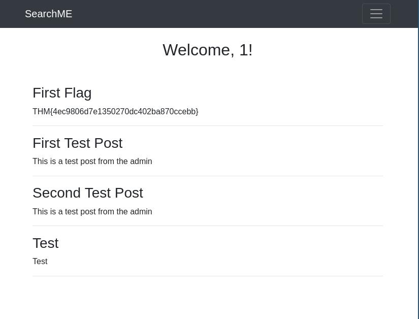

# TryHackMe CTF Challenge: Grep 

*SPOILER WARNING: I didn't blurred out the flag, so just ignore the photos, was lazy lol sorry* 

## Skills used:
- OSINT
- Reverse Shell & Obfuscation
- Burpsuite
- Gobuster 
- Nmap (I used rustscan since it's so muchh faster lol)

## Prompt:
- SuperSecure Corp, a fast-paced startup, is currently creating a blogging platform inviting security professionals to assess its security. The challenge involves using OSINT techniques to gather information from publicly accessible sources and exploit potential vulnerabilities in the web application.
- Your goal is to identify and exploit vulnerabilities in the application using a combination of recon and OSINT skills. As you progress, you’ll look for weak points in the app, find sensitive data, and attempt to gain unauthorized access. You will leverage the skills and knowledge acquired through the Red Team Pathway to devise and execute your attack strategies.

## Recon:
- We are given the host IP address: 10.201.36.31.

My first instinct, knowing that it's a web server is trying to access it on my web browser `http://10.201.36.31` but it only return a default Apache2 page ://

### RustScan

And so, I just did a simple rustscan to check for any open ports and system versions to gather any info we can, but you can use nmap (it'll just take longer).

`rustscan -a 10.201.83.184 -- -A -sS -sV`
- -a: specify the address to be scanned
- -- -A: indicates "end of RustScan flags and allow for custom nmap commands
- -sS: TCP SYN scan, only 1 step of TCP three way handshake, much more efficient than TCP connect scan
- -sV: scan for available services & version

#### Output:
- Open 10.201.36.31:22
- Open 10.201.36.31:80
- Open 10.201.36.31:443
- Open 10.201.36.31:51337

`ssl-cert: Subject: commonName=grep.thm/organizationName=SearchME/stateOrProvinceName=Some-State/countryName=US
| Issuer: commonName=grep.thm/organizationName=SearchME/stateOrProvinceName=Some-State/countryName=US
`

From the scan, we know that port 22(SSH), 80(HTTP), 443(HTTPS) and 51337(TCP/UDP) are open. We also got the domain name, grep.thm, for the IP address, which we can now mask the IP address to that domain inside `/etc/hosts file` 

We make our way to grep.thm and we found an unfinished website.There's no weird or hidden clue hidden in the main html file, the same goes for the login & register php file. 

An interesting clue arises when we try to make an account on the website. A prompt appeared `Invalid or Expired API key`

### Burpsuite 
We can look into this further by using Burpsuite on Proxy mode to intercept the POST request to the web server. The API key might be in the request sent by the user.

#### Output:

Would you look at that! Jackpot haha, we need to sub in a new API key in order to make a successful POST request. There's isn't any other hints suggesting the API key might be within any file. Since the theme of this room is OSINT, we may need to do some searching on the web.

A quick search `seachme github repo` reveals a public repo that contains the same exact files and content showed earlier on the web server. 

Going into the API folder, and we find a commit message `Fix: remove key`, meaning the firm accidentally upload their API at one point. This means, if we were to go back to and check of the commit history, then we should find the removed API key...

Bingo! We found our API key. The only thing to do is to sub this new one with the invalid one we got from our POST request, forward the edited request to the server, and we should be able to register successfully. 

Works like a charm, we now also get the first flag as a treat for a job well done in the dashboard page.

### Gobuster 
Should have done this earlier but isn't too late to start enumarating the server directories.

`gobuster dir -u "https://grep.thm" -w /usr/share/wordlists/dirbuster/directory-list-2.3-medium.txt -k -x .html,.js,.php -t 50`
- -u: specify the host 
- -w: path to wordlist for enumeration
- -k: to accept self-signed cert, since the website didn't had an official TLS certification for their HTTPS 
- -x: specify which file extension to look for

I did multiple scan for the main dir and also sub directories to speed things up. Normally, I would wait but I don't have the patience haha, there is like 800,000 files/folders...

Found mutliple interesting thing, one being a portal (upload.php) to upload file & a folder that holds those files (api/uploads)

## Exploitation

### Reverse Shell

Considering this web server runs on PHP, we can conduct a reverse shell attack, by sending a script that will tell the server to make an outbound remote connection to our machine, allowing access to the web server.

I'm using this php reverse shell script by Pentest Monkey: https://github.com/pentestmonkey/php-reverse-shell

Just need to change the IP address to our machine & pick a port number to use. 

However, if you try to upload the file then it will return an error: `{"error":"Invalid file type. Only JPG, JPEG, PNG, and BMP files are allowed."}`

If we take a look of the code of `upload.php`, we would see it will check if the file 'magic byte' is of .jpg, .png, .jpeg...etc or not 

Magic byte are the first few byte of a file which is used a recognize the type of a file. We can't simply mask the php file as a jpg file i.e shell.php.jpg 

To change the magic byte, change the hex value of the header to the respective file extension showed on upload.php

`hexeditor shell.php`

P.S I've added a bunch of giberrish text on top of the php header, since changing the header affects the php header, which affect the syntax lol

Upload the file on the portal and go to api/uploads, and click on the file to execute the script. If it works then it should look something like this: 

It passes through successfully! Now to set up a listener on the specified port using NetCat: `nc -lvnp 9999`

- -l: in listen mode, acts as a server 
- -v: verbose, show connection details
- -n: numeric only, don't try to resolve host name, more efficient
- -p: port number that listen on 

If we look and navigate through the system directory, `var` folder stands out as it contains our web server `www`

We found two interesting folders inside `www`, one of which is `backup` and the other is `leakchecker` - which seems to be anothe page 

Inside `backup` folder, we found an SQL file containing user details, and there is our admin email! 

We are so close to the finish line, only need to find another domain name for `leakchecker` which would allow us to get the admin password 

To do this, we can simply check the `/etc/hosts` whcih reveal another domain 

However, trying to access it via HTTP or HTTPS will only give us the default Apache2 page on HTTP or forbidden on HTTPS

Going back to the previous ports we scanned, one of it was the 51337, and so we can try `https://leakchecker.grep.thm:51337`

Finally, all we need to do is enter the admin email and we will get our password! 

## Final notes
This was my first serious ever CTF room and I can't believe I've spent 4 hours, not only going getting through this (with write ups and help from friends btw) but also documenting it. For future refrence, I probably need a more efficient workflow to save less time and I will censor the flag. 

Overall, learnt a ton of stuff that I wouldn't able to otherwise if I just mindlessly did the theoretical learning rooms on THM learning path. Probably the most important skill is having a clear roadmap and ideas on how you wanna tackle a room and knowing what tools are available to use, I didn't even know how to use Burpsuite prior this room lol, just learnt it on the go.

If you've read this far then 1) you're stalking through my github repo or 2) you're also doing the room right now. Either way, thank you for reading and hope it was useful :)

